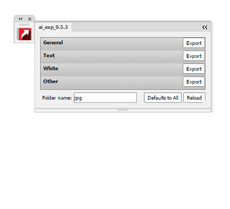
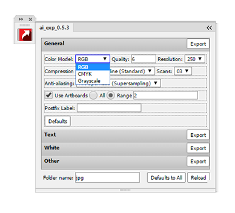
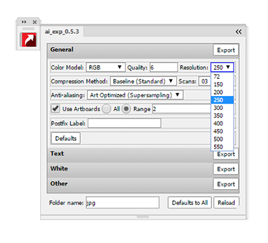
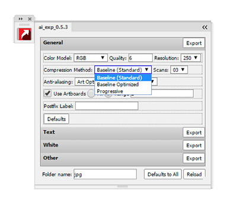
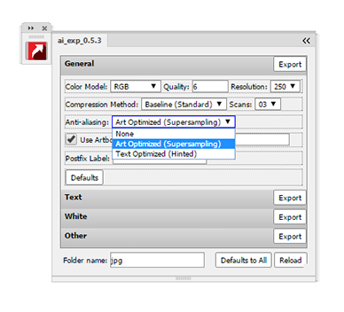

Панель экспорта из Illustrator CC в .jpg
===
Аналог родного экспорта Illustrator, но всегда под рукой и сразу несколько наборов готовых настроек
---

- В данной версии доступны 4 сета настроек, условно названных `General`, `Text`, `White`, `Other`

- Цветовые модели

- Доступные варианты разрешения конечного файла .jpg

- Метод сжатия

- Сглаживание

- По-умолчанию все файлы сохраняются в папку `jpg` рядом с `.ai`-файлом, но можно указать другой путь.
- Все настройки сохраняются автоматически

История версий
===
0.5.4
---
Исправил поведение сворачивание-разворачивание панели - в функции `fitWindowToContent()` заменил `scrollWidht\Height` на `offsetWidth\Height`
